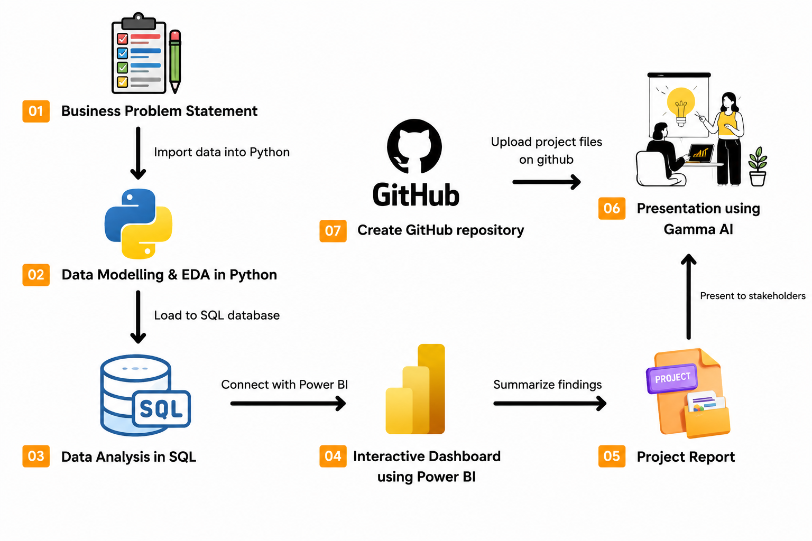

# 👨🏻‍💻 Customer Behavior Analysis Portfolio Project

This project demonstrates an end-to-end data analytics workflow using Python, SQL, and Power BI. It focuses on analyzing retail customer shopping behavior to uncover purchasing patterns, customer preferences, and business insights that support data-driven decision making.

This project showcases the complete analytics process from data cleaning to dashboard creation and reporting.

---

# 📌 Project Overview

The objective of this project is to analyze customer shopping behavior and generate actionable business insights through data analytics.

The project covers:

- 📊 Data Cleaning and Preprocessing using Python
- 🗄️ Data Analysis using SQL
- 📈 Interactive Dashboard Development using Power BI
- 📄 Business Report and Presentation

---

# 🚀 Technologies Used

- Python
- Pandas
- NumPy
- Jupyter Notebook
- SQL (MySQL / PostgreSQL / SQL Server)
- Power BI

---

# 📂 Project Structure

```
├── Business Problem Document.pdf
├── Customer Shopping Behavior Analysis.pdf
├── Customer_Shopping_Behavior_Analysis.ipynb
├── customer_behavior_dashboard.pbix
├── customer_behavior_sql_queries.sql
├── customer_shopping_behavior.csv
└── Customer-Shopping-Behavior-Analysis.pptx
```

---

# 📊 Project Workflow

### 1. Data Collection

- Load the customer shopping dataset.

### 2. Data Cleaning & Exploration (Python)

- Handle missing values
- Explore customer demographics
- Perform feature analysis
- Prepare the dataset for SQL

### 3. SQL Analysis

- Import cleaned data into a SQL database
- Execute business queries
- Analyze customer segments
- Identify purchasing trends
- Evaluate product performance

### 4. Dashboard Development (Power BI)

Build an interactive dashboard containing:

- Sales Overview
- Customer Demographics
- Product Category Analysis
- Seasonal Trends
- Payment Method Analysis
- Customer Satisfaction Metrics

### 5. Reporting

Summarize the findings and provide business recommendations based on the analysis.

---

# 📈 Key Business Questions

This project answers questions such as:

- Which customer age group contributes the highest sales?
- Which product categories generate the most revenue?
- How do discounts influence purchasing behavior?
- Which payment methods are most preferred?
- How do shopping patterns change across seasons?
- Which customer segments have the highest purchase frequency?

---

# 📁 Files Included

| File | Description |
|------|-------------|
| customer_shopping_behavior.csv | Customer shopping dataset |
| Customer_Shopping_Behavior_Analysis.ipynb | Data cleaning and exploratory analysis |
| customer_behavior_sql_queries.sql | SQL queries for business analysis |
| customer_behavior_dashboard.pbix | Interactive Power BI dashboard |
| Business Problem Document.pdf | Business problem statement |
| Customer Shopping Behavior Analysis.pdf | Project report |
| Customer-Shopping-Behavior-Analysis.pptx | Project presentation |

---

# ▶️ How to Run the Project

### Clone the repository

```bash
git clone https://github.com/vivek-noobx/customer_behavior_analysis.git
cd customer_behavior_analysis
```

### Open the Jupyter Notebook

Run:

```
Customer_Shopping_Behavior_Analysis.ipynb
```

This notebook contains:

- Data loading
- Data cleaning
- Exploratory Data Analysis
- SQL database preparation

### Import Data into SQL

- Create a database
- Import the cleaned dataset
- Execute

```
customer_behavior_sql_queries.sql
```

### Open Power BI Dashboard

Open

```
customer_behavior_dashboard.pbix
```

to explore the interactive dashboard.

---

# 📌 Skills Demonstrated

- Data Cleaning
- Exploratory Data Analysis (EDA)
- SQL Query Writing
- Data Visualization
- Dashboard Design
- Business Intelligence
- Data Storytelling

---

# 📜 License

This project is intended for educational and portfolio purposes.
